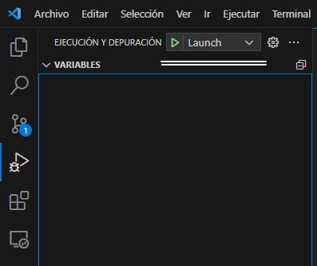

# CalculadoraSO

Este programa por consola es un simulador de la calculadora ``jsEmu48`` el cual te permite seleccionar operaciones matemáticas y operaciones de control de la calculadora.


---

## Requerimientos

Para la ejecución de este programa es necesario tener instalado gcc en nuestro dispositivo.

Comando para la instalación de los requerimientos

``` bash
sudo apt update && sudo apt upgrade #actialuzacion del paquetes
```

``` bash
sudo apt install build-essential    #instalacion de erramientas del sistema
```

``` bash
sudo apt install gbd                #instalacion del compilador
```

Verificamos que este instalado con el comando que nos dirá la versión de ``gcc``

``` bash
gcc --version                       #version del sistema
```

``` bash
sudo apt-get install wget ca-certificates  
```

---

## Ejecución

Tenemos varias secciones en la ejecución del proyecto.

### Compilación del proyecto

la compilación del proyecto estada dada por un archivo [task.json](.vscode/tasks.json) que usa ``vscode`` para la ejecución del proyecto de manera automática y también encontramos una tarea que realiza la eliminación de los ejecutables del proyecto

``` json
{
    "tasks": [
        {
            "label": "Eliminacion de los ejecutables", 
            "command": "bash",
            "args": [
                "${workspaceFolder}/BorradoDeCompilaciones.sh"
            ],
        },
        {
            "label": "Ejecucion de la compilacion",
            "command": "gcc",
            "args": [
                "-fdiagnostics-color=always",
                "-g",
                "${workspaceFolder}/Calculadora/Calculadora.c",
                "${workspaceFolder}/Calculadora/OpeMate.c",
                "${workspaceFolder}/Calculadora/Pila.c",
                "-o",
                "${workspaceFolder}/Calculadora/launch",
                "-lm"
            ]
        }
    ],
    "version": "2.0.0"
}
```

### Ejecucion del proyecto

La ejecución se lleva acabo por esta configuración con tareas de ``preLaunchTask`` que ejecuta la compilación, ``command`` que ejecuta el archivo resultante de la compilación y ``postDebugTask`` que elimina el ejecutable cuando acaba la ejecución del proyecto, el archivo es [launch.json](.vscode/launch.json).

``` json
{

    "version": "0.2.0",
    "configurations": [
        {
            "name": "Launch",
            "request": "launch",
            "type": "node-terminal",
            "preLaunchTask": "Ejecucion de la compilacion",
            "command": "clear && ${workspaceFolder}/Calculadora/launch",
            "postDebugTask": "Eliminacion de los ejecutables",
        },
    ],

}
```

Buscar la opción en (Ejecución y depuración) y dar en ``Launch``


