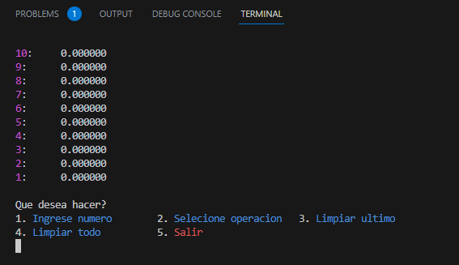
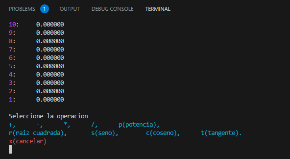

# CalculadoraSO

Este programa por consola es un simulador de la calculadora ``jsEmu48`` el cual te permite seleccionar operaciones matemáticas y operaciones de control de la calculadora.





---

## Requerimientos

Para la ejecución de este programa es necesario tener instalado gcc en nuestro dispositivo.

Comando para la instalación de los requerimientos

``` bash
sudo apt update && sudo apt upgrade #actialuzacion del paquetes
```

``` bash
sudo apt install build-essential    #instalacion de erramientas del sistema
```

``` bash
sudo apt install gbd                #instalacion del compilador
```

Verificamos que este instalado con el comando que nos dirá la versión de ``gcc``

``` bash
gcc --version                       #version del sistema
```

``` bash
sudo apt-get install wget ca-certificates  
```

---

## Ejecución

Tenemos varias secciones en la ejecución del proyecto.

### Compilación del proyecto

la compilación del proyecto estada dada por un archivo [task.json](.vscode/tasks.json) que usa ``vscode`` para la ejecución del proyecto de manera automática.

``` json
{
    "tasks": [
        {
            "type": "cppbuild",
            "label": "C/C++: gcc compilar archivo activo",
            "command": "/usr/bin/gcc",          //ubicacion de nuestro compilador
            "args": [
                "-fdiagnostics-color=always",
                "-g",
                "${file}",                      //compilacion de la calculadora
                "${fileDirname}/OpeMate.c",     //compilacion de las operaciones matematicas
                "${fileDirname}/Pila.c",        //compilacion de la pila
                "-o",
                "${fileDirname}/${fileBasenameNoExtension}",
                "-lm"                           //argumento para que se compile <math.h>
            ],
            "options": {
                "cwd": "${fileDirname}"
            },
            "problemMatcher": [
                "$gcc"
            ],
            "group": {
                "kind": "build",
                "isDefault": true
            },
            "detail": "Tarea generada por el depurador."
        }
    ],
    "version": "2.0.0"
}
```

### Script para la eliminación de ejecutables

También se tiene un bash para ``linux`` que hace la eliminación de ejecutables del proyecto, y esta configurado para hacer la ejecución desde vscode desde el archivo [launch.json](.vscode/launch.json).

``` json
{
    "version": "0.2.0",
    "configurations": [
        {
            "command": "bash BorradoDeCompilaciones.sh",    //ejecucion del bash
            "name": "Eliminacion de archivos",              //nombre de la tarea de ejecucion
            "request": "launch",
            "type": "node-terminal"
        }
    ]
}
```
